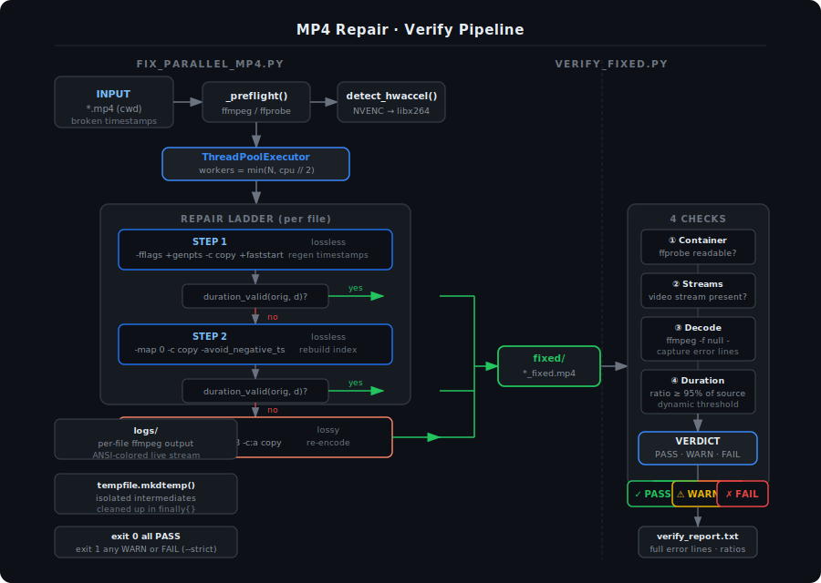

# mp4-repair-pipeline

A two-script pipeline for repairing broken MP4 files and verifying the results. Runs entirely on the local machine — no cloud, no dependencies beyond **ffmpeg**.



---

## Contents

| File | Purpose |
|---|---|
| `fix_parallel_mp4.py` | Repairs all `*.mp4` in the current directory via a three-step escalation ladder |
| `verify_fixed.py` | Verifies repaired files in `fixed/` with four integrity checks; produces a text report |
| `pipeline_diagram.svg` | Visual reference for the full pipeline |

---

## Requirements

- **Python** 3.10+
- **ffmpeg** + **ffprobe** on `PATH`

No third-party Python packages. Everything in stdlib.

```
# Verify your ffmpeg install
ffmpeg -version
ffprobe -version
```

---

## Quick Start

```bash
# 1. Drop your broken MP4s into a directory, then cd into it
cd /path/to/videos

# 2. Repair
python fix_parallel_mp4.py

# 3. Verify
python verify_fixed.py
```

Repaired files land in `fixed/`. Logs land in `logs/`. The verifier writes `fixed/verify_report.txt`.

---

## fix_parallel_mp4.py

### How it works

Each file is processed by `fix_video()` in a bounded thread pool. The repair follows a strict escalation ladder — earliest successful step wins, destructive steps only run when lossless ones fail.

| Step | Strategy | Flags | When |
|---|---|---|---|
| 1 | Regenerate timestamps | `-fflags +genpts -c copy +faststart` | Always tried first |
| 2 | Rebuild index | `-map 0 -c copy -avoid_negative_ts make_zero` | If step 1 duration invalid |
| 3 | Re-encode | `libx264` / NVENC `-crf 18 -c:a copy` | Last resort |

**Duration validation** (`duration_valid`) uses a dynamic threshold: the repaired file must preserve ≥ 95% of the original duration. For files under 1 second, any positive duration is accepted. This is intentionally more robust than a hard `d > 15` check.

**Hardware acceleration** is detected once at startup via `detect_hwaccel()` and cached for all workers. NVENC is used if available; libx264 otherwise. Codec detection via `get_source_vcodec()` prevents silent H.264 downgrade on HEVC or AV1 source material.

**Temp files** are written to `tempfile.mkdtemp()`, never next to source files. The temp directory is cleaned up in a `finally` block even on `KeyboardInterrupt`.

### Worker count

```
workers = min(len(files), max(2, cpu_count // 2))
```

One worker per file sounds reasonable but saturates cores badly on re-encode workloads. ffmpeg fans out internally across threads; `cpu // 2` is the practical ceiling before parallel workers start fighting each other.

### Output layout

```
./
├── broken_video.mp4          ← original, untouched
├── fix_parallel_mp4.py
├── fixed/
│   └── broken_video_fixed.mp4
└── logs/
    └── broken_video_<tag>.log
```

---

## verify_fixed.py

Runs four checks on every file in `fixed/`:

| # | Check | FAIL trigger | WARN trigger |
|---|---|---|---|
| 1 | Container readability | ffprobe returns no streams | — |
| 2 | Stream presence | No video stream | No audio stream |
| 3 | Full decode pass | Non-zero exit from `-f null` | Error lines in stderr |
| 4 | Duration fidelity | ratio < 50% of source | ratio 50–95% |

**The decode test** uses `ffmpeg -v error -i file -f null -`. At `-v error`, ffmpeg suppresses all informational output — anything written to stderr is a genuine decode problem. Error lines are captured verbatim and surfaced inline (first 5 in the terminal, all in the report).

### Verdict tiers

| Verdict | Meaning |
|---|---|
| `✓ PASS` | Clean decode, video stream present, duration intact |
| `⚠ WARN` | Technically playable but with decode error lines, missing audio, or slight duration loss |
| `✗ FAIL` | Unreadable container, no video, decode crash, or severe duration loss |

### Usage

```bash
# Default: verify fixed/ against ./
python verify_fixed.py

# Explicit paths
python verify_fixed.py --fixed ./fixed --source ./originals

# Treat WARN as FAIL (CI / scripting)
python verify_fixed.py --strict

# Custom report path
python verify_fixed.py --report ./audit/results.txt

# Override worker count
python verify_fixed.py --workers 4
```

### Exit codes

| Code | Condition |
|---|---|
| `0` | All files PASS |
| `1` | Any WARN or FAIL present; or any WARN with `--strict` |

Suitable for use in shell `&&` chains or CI pipelines.

### Report format

`fixed/verify_report.txt` contains the full picture for every file — no truncation. Terminal output previews the first 5 error lines; the report contains all of them.

```
verify_fixed.py — Report
============================================================

Total: 2  PASS: 1  WARN: 1  FAIL: 0

[PASS]  clean_recording_fixed.mp4
  duration : 45:12 (source: 45:14)
  ratio    : 99.9%
  codec    : h264 1920×1080
  decode   : 22.1s  errors: 0  warnings: 0

[WARN]  webcam_session_fixed.mp4
  duration : 1:12:31 (source: 1:12:33)
  ratio    : 99.5%
  codec    : h264 1920×1080
  decode   : 41.3s  errors: 14  warnings: 3
  → Decode succeeded but 14 error line(s) in stderr
  → 3 warning line(s) during decode
  ffmpeg errors:
    [h264 @ 0x...] non monotonous DTS in output stream 0:0; previous: 2754000, current: 2751900; changing to 2753999
    [mov,mp4,m4a @ 0x...] DTS 91800, next: 91440, st: 1 invalid dropping
    ...
```

---

## Common failure patterns and what they mean

**`non monotonous DTS`** — timestamp ordering is broken in the container. Step 1 or 2 of the repair usually fixes this losslessly.

**`DTS ... invalid dropping`** — ffmpeg discarded frames during playback because their timestamps were out of sequence. A WARN result here means the file decoded but may have brief visible glitches at the affected timestamps.

**`Sample rate index ... contradicts container`** — audio codec metadata mismatch. Step 3 re-encode resolves this; steps 1 and 2 will not because they copy streams without re-encoding.

**`ffprobe failed — container unreadable`** — the file structure is too corrupted for ffprobe to parse at all. Step 3 re-encode may still recover it; verify manually with `ffmpeg -i file.mp4`.

---

## Design decisions

**Why no preflight decode validation before repair?** A full `-f null` pass on a large file can take longer than the repair itself. The verifier is the right place for that check — run repair fast, verify after. Separation of concerns over pipeline purity.

**Why `duration_valid(orig, repaired)` instead of `d > 15`?** A hard threshold of 15 seconds fails silently on short clips and on files whose actual content is close to that boundary. The 95%-of-original approach is input-relative and survives edge cases.

**Why `cpu_count // 2` for workers?** Each ffmpeg process uses multiple internal threads. Spawning one worker per file looks right on paper but produces thread contention and thermal throttling on re-encode workloads. The ceiling of `cpu // 2` keeps aggregate CPU usage stable.

---

## License

MIT — see [LICENSE](LICENSE).
